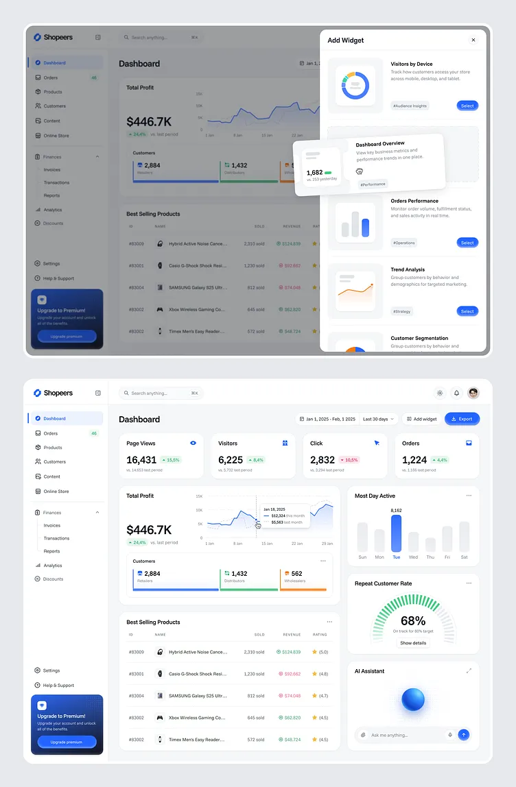

# 23 — Visual language v2: bright console (light nav, accent-carried data)

> **Status:** in progress — **CP-1 done 2026-08-27** (branch
> `style/superadmin-visual-language-cp1`, built in the `bright-console` worktree for fast
> rollback): the language is rewritten onto § Direction across `01-conventions.md`, the
> committed `superadmin-design` skill mirror, and 17's header; `.card`/`.card-section`
> and the standalone `p-table` shell gain a hairline `surface-200` border under the
> existing `shadow-card` (dark `surface-800`), while `.card-flush-table` sheds the whole
> treatment; the preset pulls dark content/overlay borders from Aura's `{surface.700}`
> down to `{surface.800}` so PrimeNG panels draw the card's hairline (preset-first — no
> new override sheet); the fixed chrome neutral is cooled from pure gray to
> `hsl(240 5% L%)` with the lightness ladder — and therefore every contrast ratio —
> untouched. Both § Open items due at CP-1 are answered (§ Decisions).
> **CP-2 done 2026-08-27** (branch `style/superadmin-visual-language-cp2`, same
> worktree): the sidebar is a light `surface-0` panel with a hairline right border in
> both the desktop aside and the mobile drawer, the `rounded-r-shell` edge and its
> radius token are deleted, rows carry a neutral hover and a `primary-100/60` active
> tint with a primary label *and* icon, `aria-current` is wired for the first time, the
> footer carries the tenant identity card, and the topbar gained the reference's search
> field as a deliberately **disabled** stub. Both § Open items due at CP-2 are answered
> (§ Decisions), and the real search became **plan 24**. **CP-3 (viz kit) next.**
> **Owner:** planning session 2026-08-26 · **Last updated:** 2026-08-27
> **Scope:** `superadmin/` only. **Depends on 22 CP-2** — every surface this plan writes must
> be authored on `primary`/`accent`/fixed-`surface`, never on names 22 is about to change
> (the same reasoning that front-ran 16 PR-2 for the 2026-07-21 shell redesign).
> **Relationship to 17:** an **evolution, not a replacement.** Plan 17's soft-executive
> skeleton stands — preset-first chrome, breathable page rhythm, `page-header` on every route,
> `rounded-control` buttons, neutral shadows, no colored glows, compact data inside airy
> chrome. Three of its decisions are **superseded** here (§ Supersessions).
> **Reference:** the two dashboard screenshots supplied by the owner 2026-08-26 (light SaaS
> console — "Shopeers"), committed as **`assets/23-reference-dashboard.png`** (both
> attachments were the same image). It is also described exhaustively in § The reference,
> so this plan survives without opening the file.
> **Not in scope (owner, 2026-08-26):** widget composition — the reference's "Add Widget"
> panel, drag-and-drop placement, and per-user saved layouts. Visual language + the shared viz
> kit only; no new backend persistence.

## Problem

1. **The nav fights the content.** Plan 17 CP-2 landed a dark brand panel (`primary-1000`,
   `rounded-r-shell`, light-on-dark rows, solid `primary-600` active row). It reads as a
   product from a different era than the white cards beside it, it burns the tenant's brand
   hue on furniture rather than on data, and in dark mode the panel and canvas collapse toward
   the same value.
2. **Every data cue is one hue.** With only `primary` available, categorical comparisons are
   tints of the same color (17's `primary-400` accent step, the single-hue bar idiom). 22 adds
   a real accent; nothing in the app uses it yet.
3. **The dashboard vocabulary is ad-hoc.** The CRM cockpit hand-rolls its KPI strip, bars, and
   trend card. The next dashboard (billing, WMS, orders) will hand-roll them again, slightly
   differently.

## The reference (read this before touching anything)

Two screenshots of the same light dashboard; the first also shows an overlay panel over a
dimmed canvas. What matters, surface by surface:

**Canvas + frame.** Near-white cool page background; the whole app sits inside a subtly
rounded outer frame with generous outer margin. Cards are pure white, ~16px radius,
**hairline border plus a very light shadow** — the border does the separating, the shadow only
lifts. Card padding is comfortable; the data inside stays compact.

**Sidebar — light, ~240px.** White panel, hairline right border, no rounded shell edge.
Wordmark + mark at the top on the same strip height as the topbar. Flat rows: icon + label,
generous row height, `rounded-control`. **Active row = soft tinted fill with primary icon +
label** (not a solid primary block). A count badge sits right-aligned on rows that carry one
(e.g. Orders · 46) as a small soft pill. One group ("Finances") is a collapsible section with a
chevron and indented, icon-less children. A separated block at the bottom holds Settings +
Help & Support, then a dark promotional card (title, one line of copy, full-width CTA button).

**Topbar.** Left: a wide search field with a leading magnifier, placeholder, and a `⌘K` hint
chip. Right: theme toggle (sun), notification bell, avatar.

> **Corrected 2026-08-27** — this read "surfaceless … it floats on the canvas", which was a
> misreading of the first two screenshots at their scale. Two close crops the owner supplied
> at CP-2 show the bar plainly: it is a **white plane with a hairline bottom rule**, split by
> a **vertical seam** between the wordmark cell and the search, the search is a **filled,
> borderless** pill (no outline), and the three trailing actions are **separate circles, each
> with its own hairline ring** — not one grouped control. § Direction 1 follows the crops.

**Page header.** `Dashboard` as a plain title on the left; on the right a row of controls —
a date-range chip (calendar icon + range), a period select ("Last 30 days"), a ghost
"Add widget" button, and a solid primary "Export" button with a leading icon.

**KPI strip — four equal tiles.** Each: micro-label + a small trailing icon, a large tabular
numeral, a delta pill beside it (green ↑ / red ↓ with a signed percentage), and a muted
comparison caption underneath ("vs. 14,553 last period").

**Cards.**
- *Total Profit* — big numeral + delta + caption, then a line chart with a faint y-grid, a
  vertical marker on hover, and a floating tooltip card (date + two labeled values).
- *Customers* — a **segmented bar**: three touching segments in three hues (primary / green /
  orange), each with its own count and label underneath and a colored rule on top.
- *Most Day Active* — a bar chart where **one bar is primary and the rest are neutral**, with
  the peak value labeled above the highlighted bar.
- *Repeat Customer Rate* — a **segmented semicircular gauge** (many small ticks, filled in
  green up to 68%), the percentage large in the center, a caption below ("On track for 80%
  target"), and a text link ("Show details").
- *Best Selling Products* — a table: ID · NAME with a square product thumbnail · SOLD ·
  REVENUE rendered in green/red with a small directional icon · RATING as a star + value.
- *AI Assistant* — a decorative gradient sphere over a prompt input with a circular send button.
- Cards that have actions carry a `…` overflow control on the header's trailing edge.

**Overlay panel (first screenshot).** A right-side panel over a dimmed canvas: title + close,
then a scrolling list of option cards — thumbnail preview on the left, title + two-line
description, a `#hashtag` tag chip, and a small solid pill "Select" button on the trailing
edge. One card is shown lifted mid-drag with a shadow, and a small floating stat card follows
the cursor. *(Only the panel/card/tag/scrim styling is in scope — the drag-and-drop feature is
explicitly not.)*

**Color logic.** Primary blue on: active nav, primary buttons, the highlighted bar, the hero
line series, links. Green/red/orange appear as **status and categorical** cues (deltas,
revenue direction, gauge fill, segment mix) — a fixed semantic set, not brand-derived.

## Direction (canonical) — "bright console"

Soft-executive's rhythm, re-lit: **white nav, hairline-bordered cards, and data that finally
has two brand colors plus a fixed status set to speak with.**

1. **Light shell.** Sidebar is a `surface-0` panel with a hairline right border (dark:
   `surface-900` panel, `surface-800` border) — the brand panel and `rounded-r-shell` retire.
   Active row = `primary-50`-equivalent tint (`bg-primary-100/60` light, `bg-primary-1000/40`
   dark) with `text-primary-700`/`primary-300` label + icon; hover = neutral tint; the
   collapsed rail and its flyouts inherit the same treatment. The floating collapse handle
   stays. **The topbar is a section of that same white plane** (owner 2026-08-27, reference
   crops — supersedes 17's surfaceless strip): `surface-0` fill, hairline bottom rule
   running unbroken across the wordmark strip *and* the topbar, with the sidebar's own
   `border-r` as the vertical seam between them. Trailing edge = three separate circles
   with a **2px border** (theme · bell · account); the search is a filled, borderless pill.
2. **Card treatment (supersedes 17's shadow-only cards).** `.card` = white, `rounded-card`,
   **hairline `surface-200` border + the existing soft `shadow-card`**, `p-6`. Borders come
   back as the primary separator; the shadow drops to a lift. Dark mode: `surface-900` fill,
   `surface-800` border, deepened shadow.
3. **Palette roles (the point of 22).**
   - `primary` — interactive + identity: buttons, links, active nav, focus, hero chart series,
     the highlighted bar.
   - `accent` — the second brand voice: secondary chart series, the second segment of a
     segmented bar, informational badges, gauge fill *when the metric is neutral rather than
     good/bad*, decorative chips. **Never** the sole carrier of a status meaning.
   - Fixed semantic set (unchanged, already documented in the brand editor's callout):
     emerald = positive/up, red = negative/down, amber = warning/pending. Deltas, revenue
     direction, and any good/bad gauge ride these — never `primary`/`accent`, so a tenant's
     brand can never make "down" look green.
   - 17's "**`primary-400` is the decorative accent**" rule is retired — that role is `accent`.
4. **Density.** 17's page rhythm holds (`p-6` cards, `gap-5`/`gap-6`, gutters
   `px-4 sm:px-6 md:px-8` + `py-6`, `h-14` strips, `py-2.5` table cells). KPI tiles are the one
   tighter unit: `p-5`, label → value → caption stacked with no extra air.
5. **Shape + type unchanged:** `rounded-card` / `rounded-chip` / `rounded-control` /
   `rounded-full` boundary, Figtree, `font-data` for every numeral, no arbitrary bracket
   values, no emojis, Lucide stroke-2. **The weight ladder moved +200 at CP-2** (owner
   2026-08-27): 600 body · 700 labels/buttons/headings · 800+ wordmark and rare emphasis.
6. **Dark mode is a first-class pass, not a follow-up** — every CP closes with both modes
   eyeballed and the contrast checks in § Verification run.

## Supersessions (17 + 01)

| Superseded | By |
|---|---|
| 17 CP-2 dark brand-panel sidebar (`primary-1000`, `rounded-r-shell`, solid `primary-600` active row) | § Direction 1 — light panel, tinted active row |
| 17 "hairline borders retire to internal dividers; cards are shadow-only" | § Direction 2 — hairline border **and** soft shadow |
| 01 § Design language "Accent step: `primary-400` is the decorative accent" | § Direction 3 — `accent` scale (22) |
| § Direction 1's own "no weight bump — the tinted row carries the active cue" | § Decisions 2026-08-27 — marker bar + one weight step on the active child |
| 17 + § Direction 1 "topbar stays surfaceless" | § Decisions 2026-08-27 — a `surface-0` bar with a hairline bottom rule |
| 01 weight ladder "400 body · 500 labels/buttons/headings" (owner 2026-07-22) | § Decisions 2026-08-27 — every rung +200 |
| 01 "`font-data` heads with Atkinson Hyperlegible" (2026-07-06) | § Decisions 2026-08-27 — Work Sans Variable, so the numeric face follows the ladder |
| 01 "the product voice's tnum can't be trusted" | 01 § Typography correction 2026-08-27 — that was Commissioner's failure; Figtree's tnum is real |
| 2026-07-22 "the theme switcher lives in the account popover" | § Decisions 2026-08-27 — it is the first of the topbar's three action buttons |
| § Direction 1's own "three separate **ringed** circles" (`ring-1`) | § Decisions 2026-08-27 — a 2px `border`, inside the box |

Everything else in 17 and 01 stands. Both documents are edited **in CP-1**, together with the
committed `.claude/skills/superadmin-design` mirror (same commit — 01's standing rule).

## The viz kit (CP-3)

New shared components under `superadmin/src/app/shared/components/`, each a standalone signal
component with typed inputs, no inline function calls in templates, constants in
`model/constants/<entity>/`, no barrels:

| Component | Owns |
|---|---|
| `kpi-tile` | micro-label, trailing Lucide icon, `font-data` value, delta pill (sign always shown, emerald/red, arrow icon), muted comparison caption. Loading state = `.skeleton` bars (17 CP-3 idiom). |
| `segmented-bar` | n proportional touching segments with per-segment color role, count, label, and top rule; degrades to a single neutral bar at n = 1 and to a track when total = 0. |
| `gauge-card` | segmented semicircular arc, percentage centerpiece, caption, optional footer link; `role="img"` + `aria-label` carrying the value, reduced-motion-safe sweep. |
| `trend-card` | hero numeral + delta + caption over a `p-chart type="line"` in the fixed-height wrapper (`h-64`, host + inner `h-full` — the PrimeNG 21 `styleClass` gotcha), faint y-grid, no point dots, `tension: 0.4`, legend off, custom tooltip card, colors re-read from the brand CSS vars on theme change. |

**Table idioms** (not components — documented in 01 and applied where they fit): leading square
thumbnail cell, directional colored numeric cell (emerald/red + arrow), star + value rating cell.

Every component is used by CP-4 in real pages; nothing ships unused (the `.icon-chip--soft`
lesson from 17 CP-5).

## Checkpoints

One PR per checkpoint, stacked, base `main`, prefix `style(superadmin)` except CP-3
(`feat(superadmin)`). **CP-1 cannot start before 22 CP-2 merges.** `npm run build` green closes
every CP, and **no screenshots unless the owner asks** — the owner watches `:4200`.

### CP-1 — Language + tokens
- [x] 01-conventions § Design language rewritten onto § Direction: light shell, bordered cards,
      the three-way palette-role split, `accent` in place of the `primary-400` step.
      Section retitled "bright console"; the two bullets describing surfaces not yet shipped
      (light nav → CP-2, `primary-400` sweep → CP-6) say so in place, so the doc reads as the
      target and never as an inventory of the running app
- [x] `.claude/skills/superadmin-design` mirror updated **in the same commit** (01's standing rule)
      — title, frontmatter description, surfaces, palette roles, nav, stat cards, data-viz,
      radius boundary, and the pre-close checklist
- [x] § Supersessions reflected in 17's header — it had **not** been done at plan time; the
      header now names all three dead decisions and points each at its § Direction replacement
- [x] `.card` / `.card-section` in `styles.scss`: hairline `surface-200` border + the existing
      `shadow-card`; dark mode `surface-900` fill, `surface-800` border, deepened shadow.
      Extended to the standalone `p-table` shell (`theme/table.scss`) — a table IS a card, and
      list pages would otherwise show a borderless card beside bordered ones; `.card-flush-table`
      now cancels `border-0` along with the radius and shadow
- [x] Preset tokens re-checked against the new card treatment (content/overlay borders) —
      preset-first, no new override sheet for looks. Light needed nothing: stock Aura already
      resolves content/overlay borders to `{surface.200}`, exactly the card hairline. Dark did:
      Aura draws `{surface.700}`, two steps brighter than the card's `surface-800`, so a dialog
      out-lined the card behind it — `content` + `overlay.select/popover/modal` now say
      `{surface.800}`
- [x] Fixed-neutral retune decided (22 § Target 3) — **cooled** (owner, § Decisions): hue 0/0% →
      **hue 240 / 5%**, lightness ladder untouched. Two edits, not four: `frontend/` and
      `website/` no longer own a neutral scale (22 § Target 2 amendment), so only
      `superadmin/tailwind.config.js` and `manttio-preset.ts` carry it — both now build it from
      the one lightness table, so they cannot drift
- [x] Outer app-frame decision recorded (§ Open ③) — **declined**, the shell stays edge-to-edge
- [x] Both modes eyeballed; `npm run build` green

### CP-2 — Shell
- [x] Sidebar → `surface-0` panel with a hairline right border (dark `surface-900` /
      `surface-800`); the `primary-1000` panel, its `rounded-r-shell` edge **and** the
      2026-07-21 sidebar shadow all retire — a shadow between two near-white surfaces
      separates nothing. The `shell: 2.35rem` radius token had no other users and was
      deleted with it. The **mobile drawer** takes the same treatment (same
      `app-sidebar` component, but the drawer's panel chrome lives on the layout's own
      `<aside>` and had to move with it)
- [x] Rows: neutral hover; active = `bg-primary-100/60` (dark `bg-primary-1000/40`) with
      `text-primary-700` / `primary-300` label **and** icon. Two things this line assumed
      were already true and were not: **`aria-current` did not exist anywhere in the
      app** (`routerLinkActive` does not set it — `ariaCurrentWhenActive="page"` is now
      on all three link forms: leaf rows, expanded children, flyout links), and
      `.nav-item:hover` did not exclude `.nav-active`, so hovering the current row
      replaced its background (harmless against the old solid row, fatal to a soft tint).
      At the owner's direction (2026-08-27, second reference screenshot) the row also
      gained a **left marker bar** standing in the nav gutter and **one weight step on
      the active child** — see § Decisions; both are cues that survive a tenant with no
      brand loaded, which the tint alone does not
- [x] **Expanded groups draw a tree** (owner 2026-08-27, first reference screenshot):
      a hairline rail dropping from the parent icon's centre with a rounded elbow into
      each child row, `.nav-tree` on the children list. Geometry is derived from the
      existing gutters rather than eyeballed — 22px to the rail (nav `px-3` + row `px-3`
      + half a `size-5` icon), 14px of elbow reach, and the rail stops 18px off the
      bottom, which is half a uniform `h-9` row. **The child pill starts where the elbow
      ends** (owner 2026-08-27, fourth round): `.nav-child` moved from `pl-11` to
      `ml-9` + `pl-2`, so the fill begins at 36px and the label stays at 44px
- [x] Wordmark strip stays `h-14` and level with the topbar; group collapse chevron +
      indented, icon-less children — unchanged, recolored for the light panel
- [x] Count-badge slot — **built at the owner's request (2026-08-27), dormant by
      design.** `NavBadge.badge?: number` on both `NavEntry` and `NavChild`, `.nav-badge`
      styled to the reference, and the row renders no pill when the count is absent or
      zero. **Nothing sets it yet** — the app still has no per-module count endpoint, and
      a fabricated number is worse than an empty slot. **§ Open ⑤ closed 2026-08-27:** the
      owner wires the source later; it stays dormant for the whole of 23. The reference paints the pill
      green; ours rides **`accent`**, because emerald is a fixed *status* colour here
      (positive/up) and a queue length is information, not good news — § Direction 3
      hands informational badges to `accent`, and this is the app's first use of it
- [x] Collapsed rail + hover/focus flyouts inherit the light treatment; flyout overflow
      behaviour unchanged; the floating collapse handle survives. The flyout's hairline
      ring now runs in **both** modes (it was dark-only, because the rail it escaped
      used to be dark) and moved from `surface-700` to the card's `surface-800`
- [x] Bottom block: **the tenant identity card** (§ Open ② — owner 2026-08-27)
- [x] Topbar: the search field ships as a **disabled visual stub** (§ Open ① — owner
      2026-08-27), and the real one is now **plan 24**. The `⌘K` chip **stays** (owner
      2026-08-27, asked): it is part of the affordance the chrome is previewing, and the
      control is `disabled`, so the hint can't be pressed into silence
- [x] **Sectioned topbar** (owner 2026-08-27, second reference crop — replaced a first
      pass that gathered the actions into one grouped pill): `surface-0` bar + hairline
      bottom rule continued across the sidebar's wordmark strip, so the seam runs the
      full width and the chrome reads as one white L; three separate `size-8` circles
      trailing (theme · bell · account) instead of a shared shell, each drawn with a
      **2px border** (owner 2026-08-27, third round — `ring-1` was too faint to hold a
      circle at this diameter); the search becomes a filled borderless pill, because on a
      white bar the fill states the field and a border would compete with the circles
- [x] **Numeric face → Work Sans Variable** (owner 2026-08-27): `font-data` follows
      the ladder instead of snapping to Atkinson's only Bold, and reads as a quiet
      grotesque beside Figtree rather than a second product's voice. Tabular digits
      verified in the binary *and* in the browser before the swap (§ Decisions)
- [x] **Weight ladder +200** (owner 2026-08-27, "font weights are off, use 200 more
      points"): 600 body · 700 labels/buttons/headings · 800+ wordmark. Applied at the
      call sites, not by redefining Tailwind's scale — `font-medium` that renders 700
      would be a lie every future reader trips on — so the sweep renamed every utility
      (`font-medium`→`font-bold` ×207, and the three rungs above it) and set the 600
      baseline once on `body`. Mirrored in 01 + the skill
- [x] Focus rings visible on the tinted rows — the global ring offsets against
      `background` (surface-100), which halos every focused row on a `surface-0` panel,
      so `app-sidebar :focus-visible` re-offsets on the panel. § Verification contrast
      measured in both modes (§ CP-2 contrast measurements)
- [x] `npm run build` green; the Playwright suite still 23/23 (two specs load the real
      shell, so a broken drawer or bell would have surfaced there)

### CP-3 — Viz kit
- [ ] `kpi-tile` — micro-label, trailing Lucide icon, `font-data` value, delta pill (sign always
      shown, emerald/red, arrow), muted comparison caption, `.skeleton` loading state (17 CP-3)
- [ ] `segmented-bar` — n proportional touching segments with per-segment color role, count,
      label, top rule; degrades to a single neutral bar at n = 1 and to a bare track at total = 0
- [ ] `gauge-card` — segmented semicircular arc, percentage centerpiece, caption, optional footer
      link, `role="img"` + `aria-label` carrying the value, reduced-motion-safe sweep
- [ ] `trend-card` — `p-chart type="line"` in the `h-64` wrapper with host + inner `h-full`
      (the PrimeNG 21 `styleClass` gotcha), faint y-grid, no point dots, `tension: 0.4`, legend
      off, custom tooltip card, colors re-read from the brand vars on theme change
- [ ] Table idioms documented in 01: thumbnail lead cell, directional colored numeric,
      star + value rating
- [ ] House rules hold: constants in `model/constants/<entity>/`, enums in `model/enums/`,
      no barrels, no inline function calls in templates, no arbitrary `[Npx]` values,
      Lucide stroke-2, no emojis
- [ ] Every component is consumed by CP-4 — anything unused is cut, not shipped
      (the `.icon-chip--soft` lesson from 17 CP-5)
- [ ] `npm run build` green

### CP-4 — Dashboards
- [ ] CRM cockpit KPI strip → `kpi-tile`; its hand-rolled copies deleted
- [ ] Channel-mix bars → `segmented-bar`; the six-month trend → `trend-card`
- [ ] A `gauge-card` lands on a real rate metric (conversión / follow-up compliance) — or the
      component is cut per CP-3's last item
- [ ] Any other dashboard surface that exists when this CP starts
- [ ] Chart colors verified across a theme toggle (var re-read), both modes
- [ ] `npm run build` green

### CP-5 — Lists + tables
- [ ] The five list pages: header treatment, thumbnail/avatar lead cells, directional colored
      numerics where a value has a direction
- [ ] Status pills re-checked against the palette-role split; **role pills stay the static blue
      ladder** (14 §1 / 16 § Mechanics 3) — not brand-shifting, not accent
- [ ] `p-table` density unchanged (`py-2.5` cells, 13–14px text); skeleton `#loadingbody` rows
      and `.empty-icon` empties kept (17 CP-3)
- [ ] Filters-popover + paginator touched only where the border treatment demands it
- [ ] `npm run build` green

### CP-6 — Forms, dialogs, detail views + sweep
- [ ] Editors, drawers and dialogs onto the bordered-card treatment; the reference's overlay
      panel — scrim, option card (thumbnail + title + description + tag chip + trailing pill
      action) — lands as shared idioms
- [ ] Detail views re-checked: client 360, equipment, report view
- [ ] Straggler audit: arbitrary bracket values → 0; weight ladder ≤ 700 outside the sanctioned
      emphasis list (post-CP-2 ladder); leftover decorative `primary-400` → `accent`
- [ ] Full § Verification pass — contrast in both modes, reduced motion, keyboard
- [ ] `npm run build` green

## Verification

- **Contrast (CRITICAL, 01 § Accessibility):** the tinted active nav row, accent-on-white,
  accent-on-`surface-900`, delta pills, and the gauge arc each clear WCAG AA (4.5:1 text,
  3:1 non-text) in **both** modes, measured against the *neutral default* brand — a tenant's
  hue must not be what saves it.
- `grep -rE '\[[0-9]+(px|rem)\]' superadmin/src` → 0 (no arbitrary values).
- No colored shadows/glows anywhere; shadows stay neutral black alpha.
- `prefers-reduced-motion` collapses the gauge sweep, chart animations, and row transitions.
- Keyboard: nav group collapse, card overflow menus, and the search field are reachable and
  escapable; `aria-current` on the active nav row.

## CP-2 contrast measurements (2026-08-27)

Measured against the **neutral default brand** exactly as § Verification demands — hue
220 / 10% for `primary`, hue 240 / 5% for `surface`, the shared lightness ladder — so no
tenant hue is what saves a number. Light panel = `surface-0`, dark panel = `surface-900`.

> **`surface-0` is not white.** `tailwind.config.js` builds the whole scale from the one
> lightness table, so `surface-0` is `hsl(240 5% 98%)`; only the PrimeNG preset's parallel
> `surface` map pins `0` to `#FFFFFF`. Measuring against white overstates every light-mode
> number by ~2%, which is how the first pass of this table was wrong. The figures below
> are against 98% L.

| Pair | Light | Dark | Bar |
|---|---|---|---|
| Active row label on the tint (`primary-700` / `primary-300`) | **6.57:1** | **9.98:1** | 4.5 |
| Active row icon on the tint | 6.57:1 | 9.98:1 | 3.0 |
| Idle `.nav-item` (`surface-700` / `surface-300`) | 6.81:1 | 8.98:1 | 4.5 |
| Idle `.nav-child` (`surface-600` / `surface-400`) | 4.88:1 | 6.39:1 | 4.5 |
| Idle `.nav-icon` (`surface-500` / `surface-400`) | 3.41:1 | 6.39:1 | 3.0 |
| Hover row text on the hover fill | 12.75:1 | 8.83:1 | 4.5 |
| Group-active label (`surface-1000` / `surface-0`) | 16.90:1 | 13.35:1 | 4.5 |
| Identity card: tenant name | 16.13:1 | 11.59:1 | 4.5 |
| Identity card: caption (`surface-600` / `surface-400`) | 4.66:1 | 5.55:1 | 4.5 |
| Active marker bar (`primary-600` / `primary-400`) on the panel | **4.83:1** | **6.42:1** | 3.0 |
| Count badge label (`accent-700` on `accent-100` / `accent-300` on `accent-1000/40`) | 6.45:1 | 9.98:1 | 4.5 |
| Tree rail + elbows (`surface-200` / `surface-800`) on the panel | 1.21:1 | 1.44:1 | — |

Every AA bar in § Verification clears. Three things the sweep turned up that the numbers
alone do not explain:

1. **The tint itself is 1.03:1 against the panel at the neutral default** (1.11:1 dark).
   That is not an AA failure — WCAG sets no contrast bar between two backgrounds, and
   1.4.11 covers component *boundaries*, not fills — and the row's state is carried by
   the label + icon hue shift and by `aria-current`, both measured above. But it is worth
   saying plainly: with **no tenant brand loaded**, `primary-100` is a 10%-saturation
   grey and the active fill is invisible; the label's `primary-700` is then the same
   value as the idle `surface-700`, so the active row reads as ordinary. The old solid
   `primary-600` row did not have that failure mode. The fallback palette exists "for the
   no-brand instant only" (`manttio-preset.ts`), so this is a broken-`/brand` state, not
   a steady one. **Closed the same day** by the owner's marker-bar + weight-step turn
   (§ Decisions): `primary-600` is a mid grey at the fallback palette, so the bar still
   measures 4.83:1 against the panel, and the child's 400→500 step carries no colour at
   all. The tint is now the *third* cue rather than the only one. Verified on screen with
   `/brand` answering 404.
2. **`.micro-label`'s house `text-surface-500` measures 3.41:1 on a light panel** — under
   the 4.5 bar for text. That is app-wide and predates this CP (91 template instances),
   so CP-2 did not sweep it; the two *new* micro-labels it adds (the "Admin" tag, the
   identity-card caption) sit at `surface-600` instead, and the sweep belongs in **CP-6's
   straggler audit**.
3. **The panel hairline is 1.16:1 against the canvas** (1.83:1 dark) — the same
   `surface-200`-on-`surface-100` pairing CP-1 shipped on every card border with the
   owner's sign-off. Consistent by construction; changing it here would fork the card
   treatment. The **tree rail and elbows** ride the same step for the same reason, and
   carry no bar of their own: they are decorative connectors restating the nesting that
   indentation already conveys, so nothing is lost when they fall below threshold.

The topbar search stub is a `disabled` control, which WCAG 1.4.3 exempts from contrast
("inactive user interface component") — its `surface-400` placeholder is deliberate, and
it stops being an exemption the moment plan 24 makes it live.

## CP-2 review passes (2026-08-27, owner asked)

The shell was reviewed against a running `:4200` — light and dark, expanded and rail,
flyouts, mobile drawer, keyboard focus, and the identity card in all three brand states
(logo, name-only, no brand at all). Everything the checklist claims holds up in the
browser, and the grey-fallback caveat in § CP-2 contrast measurements reproduces exactly
as described: the active row is discernible but weak with no tenant hue loaded.

Three things the review turned up that reading the code did not:

1. **No nav group was expanded on a cold load.** `autoExpandActiveGroup()` ran only from
   the `NavigationEnd` subscription, and the panel mounts *after* that first navigation
   fires (the layout gates the whole shell on `/auth/me`). So arriving at `/customers`
   painted four collapsed groups and no active row at all — the tinted row this checkpoint
   is *about* was invisible until the user opened a group by hand. Pre-existing since the
   2026-07-23 extraction, invisible while the active cue was a solid block on a dark panel
   you had already opened. Now expanded once in the constructor.
2. **Operaciones and CRM wore the same icon** (`LucideHeartHandshake`), which on a light
   panel reads as one group with a duplicated row. Operaciones is `LucideClipboardList`.
3. **`surface-0` is `hsl(240 5% 98%)`, not white** — see the note above the table.

A fourth arrived with the owner's second turn, and only a screenshot could have caught
it: the active-row marker and the tree elbow were both written as `li::before`. An
element has exactly one, the marker's selector outranks the elbow's, so **the active row
silently lost its elbow** — the tree looked correct on every row except the one the user
is standing on. The marker moved to `::after`, and both pseudo-elements now carry a
`z-index: 1` so the rail and elbow read as continuous *through* the tinted pill instead
of breaking behind it. (The owner later moved the pill clear of the connector entirely —
§ Decisions, fourth round — so the lift now only guards the joint where the two meet.)

## Decisions

- **Locked (2026-08-26, owner):** adopt the **light sidebar** (supersedes 17's dark brand
  panel) · scope = visual language **+ the shared viz kit**, no widget composition, no
  per-user dashboard layouts · superadmin only.
- **Decided 2026-08-27 (owner, at CP-1) — both § Open items due here:**
  - ③ **The outer rounded app frame is declined.** The shell stays edge-to-edge: 17
    § Direction 6's full-width main (owner 2026-07-21, "as much space as possible from the
    main container") still holds, and an inset frame spends 16–24px a side plus a scrollbar
    gutter — most costly on the 1366px laptops this app actually runs on. Breathing room
    keeps coming from gutters and rhythm.
  - **The fixed neutral is retuned: hue 0 / 0% → hue 240 / 5%**, the lightness ladder
    untouched. That is the reference console's cool canvas and the same cast stock `zinc`
    gives the field app and the website, at zero tenant impact (surface left the brand
    contract in 22) and zero contrast movement (nothing but hue and saturation moved).
    **Adopting zinc's lightness ladder wholesale was considered and rejected:** it deepens
    dark mode hard (`900` 18% → 10% L, `1000` 10% → 4% L) and would force a full dark-mode
    contrast re-measure across ~972 `surface-*` instances to buy nothing visible.
- **Derived (2026-08-26, planning):** cards regain a hairline border · `accent` never carries
  a status meaning alone · 17's `primary-400` accent step retires · the viz kit ships only
  what CP-4 actually uses.
- **Decided 2026-08-27 (owner, at CP-2) — both § Open items due here:**
  - ① **The topbar search ships as a visual stub, and the real one becomes plan 24.**
    The owner overrode the recommendation to leave it out: the chrome lands now, the
    capability is planned rather than deferred indefinitely. The stub is a `disabled`
    field-shaped control (`.topbar-search`, `md:` and up) with the magnifier, the
    placeholder and the `⌘K` hint — **disabled on purpose**, so it previews the chrome
    without being a live box that swallows keystrokes and answers nothing. Plan 24 owns
    the endpoint, the palette, the shortcut and the scope; until it lands the `⌘K` hint
    is chrome, not a working binding.
  - ② **The sidebar's bottom block is the tenant identity card**, not a promo card. A
    tenant admin has nothing honest to promote — no plan/usage to upsell, no marketing
    slot — so the space answers a question the app never answered before: *whose* admin
    am I inside. Tenant logo (the dark variant picked by theme, exactly as the login
    brand panel picks it) or the tenant name when there is no logo, plus a muted
    "Panel de administración" caption, on a `surface-100` tile behind a hairline top
    rule. Gated on `BrandState.loaded`, so a branded tenant never flashes the manttio
    fallback; the collapsed rail shows the square isologo alone, and nothing at all when
    the tenant has no isologo.
- **Decided 2026-08-27 (owner, reviewing CP-2 against the reference) — the active row
  gets two more cues, and § Direction 1's "no weight bump" is superseded:**
  - **A left marker bar, on top-level rows only.** A `primary-600` (dark `primary-400`)
    3×20px pill standing in the nav's `px-3` gutter, left of the tinted row and clear of
    it. **Highlight-only for the active child; highlight + bar for the parent it sits
    under** (owner, refining the same day) — the bar marks the entry you are *inside*,
    and keeping it off children leaves the gutter to the tree. Selected as
    `.nav-rail > ul > li:has(> .nav-active, > .nav-group-active)::after`, drawn on the
    `li` because `.nav-item`/`.nav-child` are `overflow-hidden` for the rail's width ease,
    and offset from the **top** rather than centred: an expanded group's `li` wraps its
    whole children list, so `top: 50%` would drop the bar into the middle of the group.
    This is the cue that does **not** depend on the tenant's hue: 4.83:1 against the panel
    at the neutral fallback, where the tint measures 1.03:1. It is therefore also the
    answer to § CP-2 contrast measurements finding ①.
  - **The active-trail parent is highlighted, not muted.** § Direction 1 had the group
    holding the current page carry "the same emphasis one step quieter"; it now takes the
    same tint and the same primary label as an active row. Hover had to learn about it
    too — `.nav-item:not(.nav-active):not(.nav-group-active):hover`, or hovering the
    parent washes its tint away, the same bug the active row had.
  - **One weight step on the active child.** `.nav-child` idles one rung below `.nav-item`;
    the active child now matches its parent. Colour-free, and still inside the ladder —
    400/500 when decided, 600/700 after the same day's +200 turn. § Direction 1's "no weight bump — the tinted row carries the
    active cue" is retired: the tinted row could not carry it alone.
  - **The count badge rides `accent`, not the reference's green.** Emerald is a fixed
    status colour in this app (positive/up) and a queue length is neither good nor bad;
    § Direction 3 already assigns "informational badges" to `accent`. The slot ships
    dormant — no entry sets a count, because no endpoint produces one.
- **Decided 2026-08-27 (owner, second review round) — type weight and the topbar:**
  - **The weight ladder moves +200, wholesale.** "Font weights are off — use 200 more
    points." Every rung of the 2026-07-22 400/500 ladder shifts two steps: **600 body ·
    700 labels/buttons/headings · 800+ wordmark and rare emphasis.** That turn's
    *reasoning* survives inside the ladder — size and tracking still carry hierarchy, no
    active state bumps weight — the whole thing just sits heavier. Two consequences worth
    knowing: (a) the 600 baseline is set once on `body`, so everything that states no
    weight inherits it, which is why the sweep is 207 renamed utilities and not 800; and
    (b) `font-data` (Atkinson Hyperlegible) ships only 400 and 700, so CSS font matching
    snaps every rung ≥ 600 to the 700 face — numerals, money columns and select values all
    land on Atkinson Bold. That reads *in step* with the heavier chrome rather than broken,
    but it is a real change to every data cell in the app and the cheapest place to walk it
    back is the one `font-semibold` on `body`. **(b) was closed the same day** —
    see the Work Sans swap below.
  - **The numeric face becomes Work Sans Variable** (owner, immediately after seeing
    the ladder land: "can we use a different font for numbers? maybe work sans").
    Atkinson Hyperlegible had two problems at once: it ships only 400 and 700, so
    every rung of the new ladder snapped to Bold, and its high-legibility letterforms
    read as a different product sitting inside a Figtree cell. Work Sans is variable
    100–900, so `font-data` now tracks the same rungs as the body text, and it sits
    beside Figtree as a quiet grotesque.
    **Verified before adopting, not assumed** — the repo's own 2026-07-06 lesson is
    that Commissioner *declared* `tnum` and it was a no-op. Checked twice: in the
    binary, `tnum` maps every digit to a `.tf` glyph at a uniform 604/1000 advance;
    in the browser, every digit measures 80px per 10 at both 600 and 700, and
    90/60/80… with the feature off — so the feature is what aligns the columns, not
    an accidentally monospaced face.
    **Side finding, recorded in 01:** Figtree's `tnum` is real too (uniform 620/1000).
    The old rule "the product voice's tnum can't be trusted" was a generalization of
    Commissioner's failure and expired when Figtree replaced it; a separate numeric
    face is now a design choice, not a workaround.
  - **The topbar is sectioned, and the actions are three separate circles.** First pass
    gathered bell + account into one bordered pill; the reference crops show otherwise and
    the owner rejected it. What the reference actually draws: a white bar with a hairline
    bottom rule, a vertical seam between the wordmark and the search, a *filled borderless*
    search pill, and three detached ringed circles on the trailing edge. Ours reproduces
    each — the vertical seam for free (the sidebar's `border-r`, since the strips are
    already level at `h-14`), the horizontal rule by giving the sidebar's wordmark strip
    the same `border-b` so it runs unbroken across the full width.
  - **The theme switcher comes back out of the account popover.** It is the first of the
    reference's three circles. Kept in *one* place, not both — two controls for one setting
    is how a shell rots. Supersedes the 2026-07-22 slim-topbar decision.
  - **The account button loses its name and chevron.** The reference's avatar carries
    neither, and the popover it opens already states name + email + role. The name reaches
    assistive tech and the tooltip through `aria-label`/`title` instead, so nothing that was
    readable stopped being readable.
- **Decided 2026-08-27 (owner, third review round) — the action circles get a 2px
  border.** The sectioned strip was accepted ("this is good"); the stroke was not. At
  `size-10` a `ring-1` hairline dissolved into the white bar and the three circles read as
  smudges rather than buttons — the reference draws a stroke you can see. **`border-2`, not
  `ring-2`:** Tailwind's ring is an outward box-shadow spread, so a 2px ring would grow each
  circle by 4px visually and shrink the row's `gap-2` to 4px of daylight; a border sits
  inside the box and leaves the 8px gap intact. Hover moves the border one step darker
  (`surface-300`, `primary-300`) instead of only the fill, so the stroke stays the thing the
  eye tracks. Applies to `.topbar-avatar` too — same circle, brand-tinted.
  - **The `⌘K` chip stays in the search stub** (owner: "no", asked whether to drop it
    while the binding does not exist). It is part of what the control *shows* — the chrome
    is previewing the affordance the way the reference draws it, and the button is
    `disabled`, so nobody can press the hint and get silence. Plan 24 makes it true.
- **⑤ closed 2026-08-27 (owner) — `NavBadge.badge` is deferred, and the owner will wire
  it.** The slot ships **dormant**: styled, `accent`-tinted, and set by nothing. No
  placeholder count, no invented source — a badge that shows a number nobody can act on is
  worse than an empty rail. Whatever counting endpoint eventually feeds it is the owner's
  to pick and implement; CP-2 is done at the slot.
- **Decided 2026-08-27 (owner, fourth review round) — the child highlight starts where
  the connector ends.** The tint used to span the full child row, so the tree's rail ran
  straight down the face of the active pill and the elbow crossed into it; lifting both
  over the fill made that legible, not correct. `.nav-child` moves from `pl-11` to
  **`ml-9` + `pl-2`**: 22px of rail plus the elbow's 14px of reach is exactly 36px, so
  the elbow now terminates *at* the pill's left edge and the highlight begins there. The
  label does not move — 36 + 8 is the same 44px `pl-11` gave it — so this changes only
  where the fill starts, in both the active tint and the hover tint.
- **Decided 2026-08-27 (owner, fifth review round) — the action circles are `size-8`
  (32px), not `size-10`.** The icons drop with them, `size-5` → `size-4`, keeping the
  half-diameter proportion the 40px circles had — a 20px glyph in a 28px content box would
  have left 4px of air and read as a cramped button rather than a small one. The bell's
  unread badge rescales too (`h-4` → `h-3.5`) and moves onto the circle's upper-right arc
  (`-right-0.5 -top-0.5`): at the old size it covered half the smaller bell. **The search
  pill is still `h-10`** — flagged to the owner, not changed unasked.
- **Open — decide at the CP that needs it:** ④ Whether the gauge's default fill is
  `accent` or emerald when the metric has no good/bad direction (CP-3).
